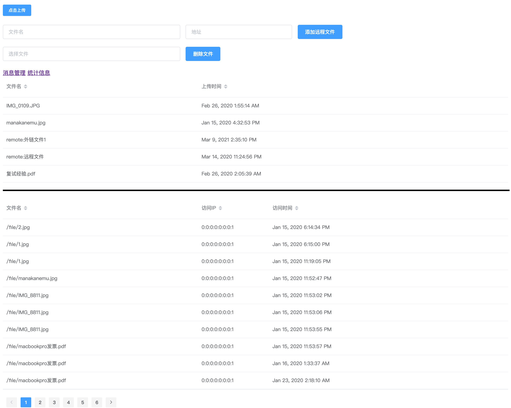

# 简单文件共享服务  
项目构建：Maven  
后端：Spring Boot + Mybatis  
前端：Vue + Element + Echarts  
要分享的文件放在File文件夹内  
网站可以统计各个资源被访问次数，并记录网站访问量   
[使用效果(统计和管理员功能需要后台支持)](https://manakanemu.github.io/FileServer/)  
  

